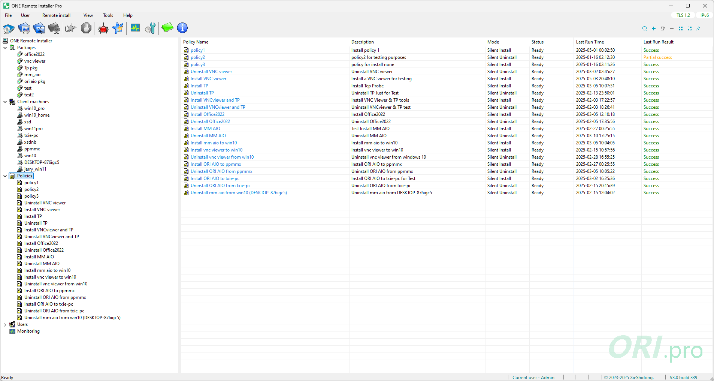

# ONE Remote Installer

**ONE Remote Installer** is a next-generation solution for batch software deployment across local area networks. Designed to eliminate the inefficiencies of one-by-one installation, it empowers administrators to remotely install standardized software packages on multiple machines simultaneously — all from a single console.

---

## 🚀 Why ONE Remote Installer?

Streamline large-scale software deployment across LAN environments — reduce repetitive effort, cut time & cost, and improve reliability.

---

## 🧭 Key Features

### 🔧 Centralized Control  
Manage packages, clients, policies, and execution from one unified interface.

### ⚡ Batch & Quick Modes  
Execute multiple deployment policies or perform one-off quick installs in seconds.

### 🤖 Silent Automation  
Supports standardized installers with silent arguments for unattended rollout.

### 🧩 Modular & Scalable  
Logical separation of packages, machines, users, and policies minimizes mistakes.

### 📊 Monitoring & Logging  
Real-time status feedback with configurable logging and security options.

### 🔐 Role-Based Access  
Administrative safeguards reduce accidental installs or removals.

---

## 🌐 Dual-Stack Networking

Full support for **IPv4 and IPv6**, ensuring compatibility with modern and heterogeneous network environments.

---

## 🌍 Internationalization & Localization

Seamless UI language switching across 12 languages:

> English, Simplified Chinese, Traditional Chinese, Arabic, German, Spanish, French, Italian, Japanese, Korean, Portuguese, Russian

---

## 🏫 Ideal Use Cases

ONE Remote Installer is particularly suitable for:

- School computer labs
- Government agencies
- Corporate IT departments
- Enterprise-scale deployments

By reducing installation costs and saving time, it dramatically improves productivity and operational efficiency.

---

## 🛒 UWP App from Microsoft Store

ONE Remote Installer is available in three editions on the Microsoft Store:

| Edition | Description | Store Link |
|--------|-------------|------------|
| **Trial** | Includes all Standard features with a 30-day evaluation period | [Get Trial](https://apps.microsoft.com/detail/9MW51QV15MHS?hl=en-us&gl=CN&ocid=pdpshare) |
| **Std** | Core remote installation capabilities, ideal for small networks | [Get Std](https://apps.microsoft.com/detail/9N13KWGL5ZS1?hl=en-us&gl=CN&ocid=pdpshare) |
| **Pro** | Enhanced tools and additional features for medium to large networks | [Get Pro](https://apps.microsoft.com/detail/9NQK6XMPLM6F?hl=en-us&gl=CN&ocid=pdpshare) |

---

## 📦 Installation Overview

Install ONE Remote Installer on a single administrator machine.  
Follow the user manual to remotely deploy software to other machines within the same LAN.  
No disruption to target machines — no repetitive manual operations.

---

## 📄 License

This repository is for documentation and binary distribution only.  
Forking is not permitted for derivative work or redistribution.  
ONE Remote Installer is a **commercial product** and not open source.

---

## 📬 Support

For product inquiries, licensing, or technical support, please contact the publisher via the Microsoft Store or your enterprise support channel.
